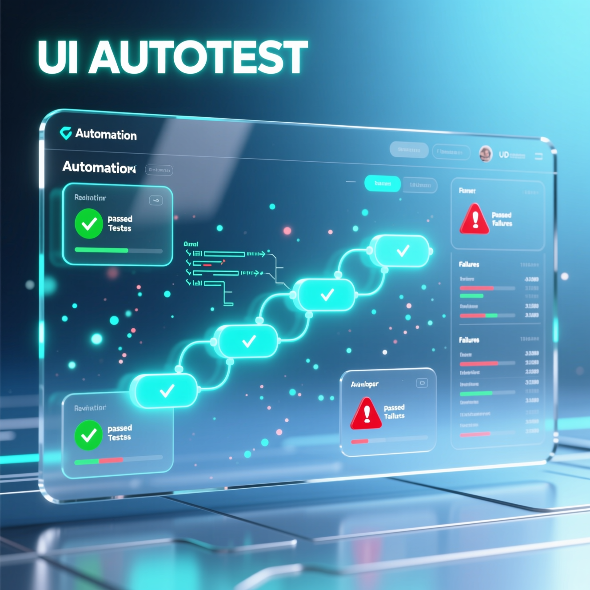

<figure><figcaption></figcaption></figure>

# UI_autotest_new

## Введение

**Что это за проект? Для чего он?**

“**UI_autotest_new**” - это проект выполненных заданий, выданных компанией Simbirsoft. В нем Вы найдете следующие выполненные задания:

* Задача U0. Настройка окружения;
* Задача U1. Создание проекта с автотестами с нуля;
* Задача U2. Allure;
* Задача U3. DataProvider;
* Задача U4. Screenshots;
* Задача U5. Cookies;
* Задача U6. JavaScriptExecutor;
* Задача U7. Параллельный запуск тестов;
* Задача U8. Перезапуск упавших тестов;
* Задача U9. Браузеры;
* Задача U10. Drag n Drop (IFrame);
* Задача U11. Tabs;
* Задача U12. Alerts;
* Задача U13. Basic auth;

**Дисклеймер**:

* Проект создан для проверки Лучшим Ментором Konstantin-ом